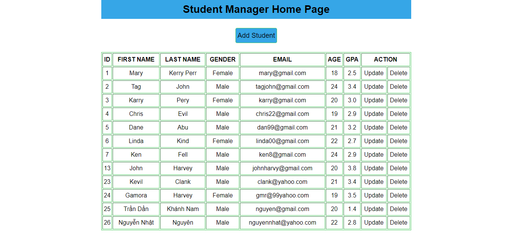
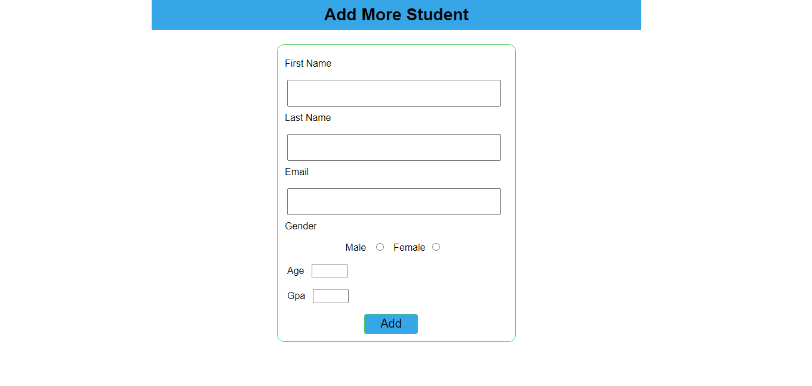
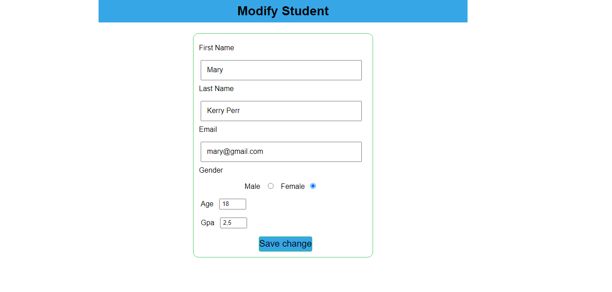
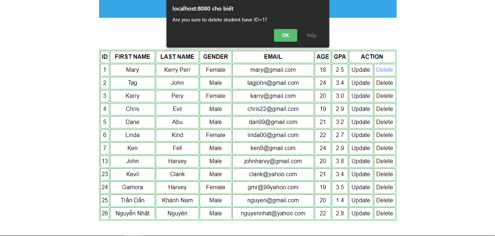

## Student manager project using jsp/servlet + jdbc with basically CRUD functionalities

### Setup environment:
* Eclipe
* Mysql WorkBench
* Tomcat 8.5
* JDK 1.8

### Screen shot:
* View Student List

* Add Student 

* Update Student

* Delete Student

